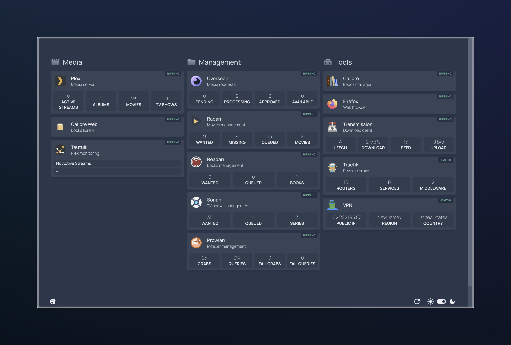

# Media management system Docker

This project is a docker-compose configuration for a media management system. This uses a WireGuard VPN to access the applications. Applications like Plex and the *arrs are used to manage and consume media.



## Table of Contents

- [About](#about)
    - [Applications list](#applications-list)
    - [Variables list](#variables-list)
    - [Profiles list](#profiles-list)
- [Quick start](#quick-start)
- [Configuration](#configuration)
    1. [Install the requirements](#1-install-the-requirements)
    2. [Initialize the environment](#2-initialize-the-environment)
    3. [Start the containers](#3-start-the-containers)
    4. [Configure the applications](#4-configure-the-applications)
        - [Plex](#plex)
        - [Radarr, Sonarr](#radarr-sonarr)
        - [Prowlarr](#prowlarr)
        - [Overseerr](#overseerr)
        - [Tautulli](#tautulli)
        - [Plex Meta Manager](#plex-meta-manager)
        - [Homepage](#homepage)
        - [Traefik](#traefik)
- [File structure](#file-structure)

## About

### Applications list

#### Media

Applications for using media.

| Application | Description | Default URL | Default port |
| ----------- | ----------- | ----------- | ------------ |
| [Plex](https://www.plex.tv/) | Media server | http://plex.media.localhost | 32400 |
| [Tautulli](https://tautulli.com/) `optional` | Plex monitoring | http://tautulli.media.localhost | 8181 |
| [Plex Meta Manager](https://metamanager.wiki) `optional` | Plex metadata management |  |  |

#### Management

Applications for managing media.

| Application | Description | Default URL | Default port |
| ----------- | ----------- | ----------- | ------------ |
| [Overseerr](https://overseerr.dev/) | Request management | http://overseerr.media.localhost | 5055 |
| [Radarr](https://radarr.video/) | Movie management | http://radarr.media.localhost | 7878 |
| [Sonarr](https://sonarr.tv/) | TV management | http://sonarr.media.localhost | 8989 |
| [Prowlarr](https://prowlarr.com/) | Indexer management | http://prowlarr.media.localhost | 9696 |
| [Transmission](https://transmissionbt.com/) | Torrent client | http://transmission.media.localhost | 9091 |
| [Firefox](https://docs.linuxserver.io/images/docker-firefox/) | Browser | http://browser.media.localhost | 5800 |

#### Tools

| Application | Description | Default URL | Default port |
| ----------- | ----------- | ----------- | ------------ |
| [Home page](https://gethomepage.dev/v0.8.3/) | Home page | http://media.localhost | 6900 |
| [Transmission](https://transmissionbt.com/) | Torrent client | http://transmission.media.localhost | 9091 |
| [Firefox](https://docs.linuxserver.io/images/docker-firefox/) | Browser | http://browser.media.localhost | 5800 |
| [Watchtower](https://containrrr.dev/watchtower/) | Container updater |  |  |
| [Autoheal](https://github.com/willfarrell/docker-autoheal/?tab=readme-ov-file) | Container restarter |  |  |

#### Others

| Application | Description | Default URL | Default port |
| ----------- | ----------- | ----------- | ------------ |
| [Traefik](https://traefik.io/traefik/) | Reverse proxy |  | 80 |
| Traefik dashboard | Reverse proxy dashboard | http://traefik.media.localhost | 8080 |

### Variables list

The variables are stored in the `.env` file. Initially, the `.env.template` file must be copied to `.env` and the variables must be added.

The `.env` file contains the environment variables for the containers.

| Variable | Description | Default value |
| -------- | ----------- | ------------- |
| `USER_ID` | User ID | `1000` |
| `GROUP_ID` | Group ID | `1000` |
| `TZ` | Timezone | `Etc/UTC` |
| `COMPOSE_PROFILES` | Profiles to include separated by spaces (See [profiles list](#profiles-list)) | `""` |
| `WIREGUARD_PRIVATE_KEY`* | Wireguard private key | `""` |
| `WIREGUARD_PUBLIC_KEY`* | Wireguard public key | `""` |
| `WIREGUARD_ENDPOINT`* | Wireguard endpoint | `""` |
| `PLEX_TOKEN` | Plex token | `""` |
| `TAUTULLI_TOKEN` | Tautulli token | `""` |
| `RADARR_TOKEN` | Radarr token | `""` |
| `SONARR_TOKEN` | Sonarr token | `""` |
| `PROWLARR_TOKEN` | Prowlarr token | `""` |
| `OVERSEERR_TOKEN` | Overseerr token | `""` |
| `LIBRARY_MOVIES_PATH` | Path to the directory where movies will be stored | `"~/Movies/Plex/Movies"` |
| `LIBRARY_TV_PATH` | Path to the directory where TV shows will be stored | `"~/Movies/Plex/TV"` |
| `DOWNLOADS_PATH` | Path to the directory where downloads will be stored | `"~/Movies/Download"` |
| `DOMAIN` | Domain name to access the applications | `localhost` |
| `HOME_SUBDOMAIN` | Subdomain for the home page | `media` |
| `TRAEFIK_SUBDOMAIN` | Subdomain for Traefik | `traefik.media` |
| `PLEX_SUBDOMAIN` | Subdomain for Plex | `plex.media` |
| `TAUTULLI_SUBDOMAIN` | Subdomain for Tautulli | `tautulli.media` |
| `RADARR_SUBDOMAIN` | Subdomain for Radarr | `radarr.media` |
| `SONARR_SUBDOMAIN` | Subdomain for Sonarr | `sonarr.media` |
| `PROWLARR_SUBDOMAIN` | Subdomain for Prowlarr | `prowlarr.media` |
| `OVERSEERR_SUBDOMAIN` | Subdomain for Overseerr | `overseerr.media` |
| `TRANSMISSION_SUBDOMAIN` | Subdomain for Transmission | `download.media` |
| `FIREFOX_SUBDOMAIN` | Subdomain for Firefox | `browser.media` |
| `TRAEFIK_PORT` | Port for Traefik | `80` |
| `TRAEFIK_DASHBOARD_PORT` | Port for Traefik dashboard | `8080` |
| `HOMEPAGE_PORT` | Port for the home page | `6900` |
| `PLEX_PORT` | Port for Plex | `32400` |
| `TAUTULLI_PORT` | Port for Tautulli | `8181` |
| `RADARR_PORT` | Port for Radarr | `7878` |
| `SONARR_PORT` | Port for Sonarr | `8989` |
| `PROWLARR_PORT` | Port for Prowlarr | `9696` |
| `OVERSEERR_PORT` | Port for Overseerr | `5055` |
| `TRANSMISSION_PORT` | Port for Transmission | `9091` |
| `FIREFOX_PORT` | Port for Firefox | `5800` |

> `*` Required variables

### Profiles list

Profiles are defined in the `docker-compose.yml` file. They are used to define which applications to start which enables to have optional applications. Use the variable `COMPOSE_PROFILES` to define which profiles to use.

| Profile | Description | Applications |
| ------- | ----------- | ------------ |
| `plex_plugin` | Plex plugin | Tautulli, Plex Meta Manager |


## Quick start

This is the step by step guide to start the containers.

> **Note**: The quick start guide uses urls with the default values to navigate in the browser (ex: `http://movie.media.localhost`). If the default values are changed, the urls must be changed accordingly. You can also use the ports directly (ex: `http://localhost:7878`), but make sure to use the custom port if it is changed.

### 1. Install the requirements

- [Docker](https://docs.docker.com/get-docker/)
- [Docker Compose](https://docs.docker.com/compose/install/)

### 2. Initialize the environment

Copy the `.env.template` file to `.env` and add the required variables in the `.env` file.

```bash
cp .env.template .env
```

#### 2.1. Add the required variables

Some variables are required to start the containers (e.g. WireGuard keys). Those variables are marked with a `*` in the [variables list](#variables-list).

#### 2.2. Select the profiles

Some applications are optional. To enable them, add the profiles in the `COMPOSE_PROFILES` variable. The profiles are separated by spaces. See the [profiles list](#profiles-list) for more information.

### 3. Start the containers

A makefile is available to start the containers. Otherwise, `docker-compose` can be used.

```bash
make
```

or

```bash
docker-compose up -d
```

You can now access the applications. The default URL is http://media.localhost. This opens the home page with all the apps.

### 4. Configure the applications

#### Plex

Go to `https://plex.media.localhost` and follow the instructions.

#### Radarr, Sonarr

> For Radarr and Sonarr, the configuration is the same. So, only Radarr is explained.

1. Go to `https://radarr.media.localhost`.
2. Add root folder: 
    1. Go to `Settings` > `Media Management` > `Root Folders` > `Add Root Folder`
    2. Add the path `/movies`
3. Add download client:
    1. Go to `Settings` > `Download Client` > `Add Download Client`
    2. Select `Transmission`
    3. Enter the following information:
        - `Host`: `localhost`
        - `Port`: `9091`
4. Connect to Plex:
    1. Go to `Settings` > `Connect` > `Add Connection`
    2. Select `Plex Media Server`
    3. Enter the following information:
        - `host`: `localhost`
        - `port`: `32400`
5. Get the API key:
    1. Go to `Settings` > `General`
    2. Copy the API key
    3. Paste the API key in the `.env` file

> **Note**: The ports specified are the internal ports used inside the containers. If the ports are changed in the `.env` file, _the ports must NOT be changed_ in the application configuration.
#### Prowlarr

1. Add apps (Radarr, Sonarr)
    1. Go to `Settings` > `Apps` > `+`
    2. Select `Radarr` or `Sonarr`
    3. Enter the following information:
        - `Prowlarr Server`: `http://localhost:9696`
        - `Radarr Server`: `http://localhost:7878`
        - `API Key`: API key of Radarr
    4. Click on `Test`
    5. Click on `Save`
2. Add indexers
    1. Go to `Indexers` > `Add Indexer`
    2. Add the wanted indexers
3. Check configuration
    1. Go to `Radarr`
    2. Go to `Settings` > `Indexers`
    3. The indexers must be present
4. Get the API key:
    1. Go to `Settings` > `General`
    2. Copy the API key
    3. Paste the API key in the `.env` file

> **Note**: The ports specified are the internal ports used inside the containers. If the ports are changed in the `.env` file, _the ports must NOT be changed_ in the application configuration.

#### Overseerr

1. Go to `https://overseerr.media.localhost`.
2. Sign in with Plex.
3. Configure Plex
    1. Enter the following information:
        - `Hostname`: `vpn`
        - `Port`: `32400`
        - `Use SSL`: `false`
        - `Web App`: `http://plex.media.localhost`
    2. Click on `Save changes`
    3. Select the libraries to sync
    4. Click on `Continue`
4. Configure Radarr
    1. Enter the following information:
        - `Hostname`: `vpn`
        - `Port`: `7878`
        - `Use SSL`: `false`
        - `Api key`: API key of Radarr
        - `External URL`: `http://radarr.media.localhost`
        - The rest is up to you
5. Configure Sonarr
    1. Enter the following information:
        - `Hostname`: `vpn`
        - `Port`: `8989`
        - `Use SSL`: `false`
        - `Api key`: API key of Sonarr
        - `External URL`: `http://sonarr.media.localhost`
        - The rest is up to you
6. Click on `Finish setup`
7. Get the API key:
    1. Go to `Settings` > `General`
    2. Copy the API key
    3. Paste the API key in the `.env` file

> **Note**: The hostname specified is the name docker-compose name of the VPN container. The hostname should always be `vpn`.

> **Note**: The ports specified are the internal ports used inside the containers. If the ports are changed in the `.env` file, _the ports must NOT be changed_ in the application configuration.

#### Tautulli

1. Go to `https://tautulli.media.localhost`.
2. Follow setup instructions.
    1. Configure Plex
        1. Enter the following information:
            - `Hostname`: `vpn`
            - `Port`: `32400`
            - `Use Secure Connection`: `false`
            - `Remote Server`: `false`
        2. Click on `Verify`
3. Get the API key:
    1. Go to `Settings` > `Web Interface`
    2. Copy the API key
    3. Paste the API key in the `.env` file

#### Plex Meta Manager

> TODO

#### Homepage

The homepage is automatically configured directly from the Docker Compose file.

When the homepage container starts, it automatically copies the configurations from `./config/homepage/templates` to `./config/homepage`. Those configurations are empty by default, but the apps are added automatically.

To add more configurations, see the [documentation](https://gethomepage.dev) and update the files in `./config/homepage` (and not in `./config/homepage/templates`).

#### Traefik

Traefik is automatically configured directly from the Docker Compose file. There is no need to configure it.

## File structure

```
.
├── config/
│   └── */ # Application specific configurations
│
├── docker/
│   ├── management.yml  # Docker Compose file for management applications
│   ├── media.yml       # Docker Compose file for media applications
│   ├── tools.yml       # Docker Compose file for tools applications
│   └── vpn.yml         # Docker Compose file for VPN
│
├── .env.template       # Environment variables template
├── docker-compose.yml  # Docker Compose file
└── Makefile            # Makefile with scripts to start/stop the containers
```